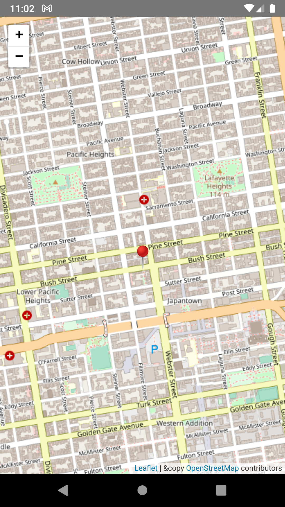
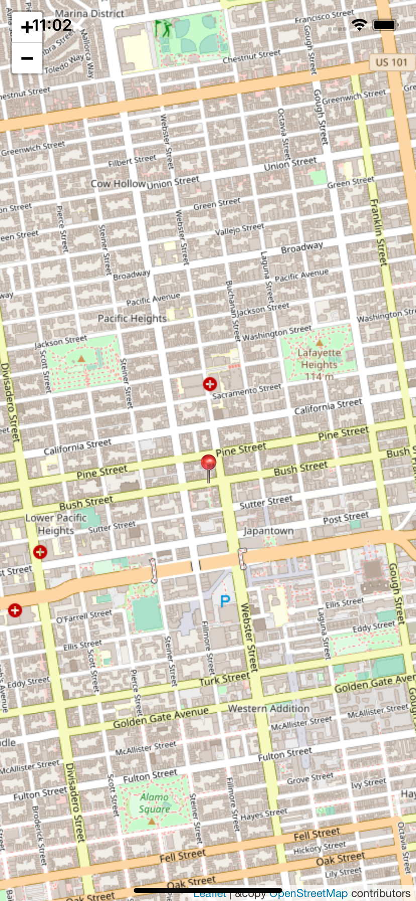

# react-native-leaflet

A LeafletView component using WebView and Leaflet map for React Native applications

Notes: This project is replacement for https://github.com/reggie3/react-native-webview-leaflet, which no longer maintain by author and work only with expo.

[](https://www.npmjs.com/package/react-native-leaflet-view)
[](https://www.npmjs.com/package/react-native-leaflet-view)
[](https://www.npmjs.com/package/react-native-leaflet-view)

       

## Installation

Install using npm or yarn like this:

```sh
npm install --save react-native-leaflet-view
```

or

```sh
yarn add react-native-leaflet-view
```

## Usage

```js
import { LatLng, LeafletView } from 'react-native-leaflet-view';

<LeafletView
    // The rest of your props, see the list below
/>

```

## Props

| property            | required | type                            | purpose                                                                                                                                                                                                         |
| ------------------- | -------- | ------------------------------- | --------------------------------------------------------------------------------------------------------------------------------------------------------------------------------------------------------------- |
| loadingIndicator    | optional | React.ReactElement              | custom component displayed while the map is loading                                                                                                                                                             |
| onError             | optional | function                        | Will receive an error event                                                                                                                                                                                     |
| onLoadEnd           | optional | function                        | Called when map stops loading                                                                                                                                                                                   |
| onLoadStart         | optional | function                        | Called when the map starts to load                                                                                                                                                                              |
| onMessageReceived   | required | function                        | This function receives messages in the form of a WebviewLeafletMessage object from the map                                                                                                                      |
| mapLayers           | optional | MapLayer array                  | An array of map layers                                                                                                                                                                                          |
| mapMarkers          | optional | MapMarker array                 | An array of map markers                                                                                                                                                                                         |
| mapShapes           | optional | MapShape[]                      | An array of map shapes                                                                                                                                                                                          |
| mapCenterPosition   | optional | {lat: [Lat], lng: [Lng]} object | The center position of the map. This coordinate will not be accurate if the map has been moved manually. However, calling the map's setMapCenterPosition function will cause the map to revert to this location |
| ownPositionMarker   | optional | Marker                          | A special marker that has an ID of OWN_POSTION_MARKER_ID                                                                                                                                                        |  |
| zoom                | optional | number                          | Desired zoom value of the map                                                                                                                                                                                   |
| doDebug             | optional | boolean                         | A flag for debug message logging                                                                                                                                                                               |

## Contributing

See the [contributing guide](CONTRIBUTING.md) to learn how to contribute to the repository and the development workflow.

## License

MIT
